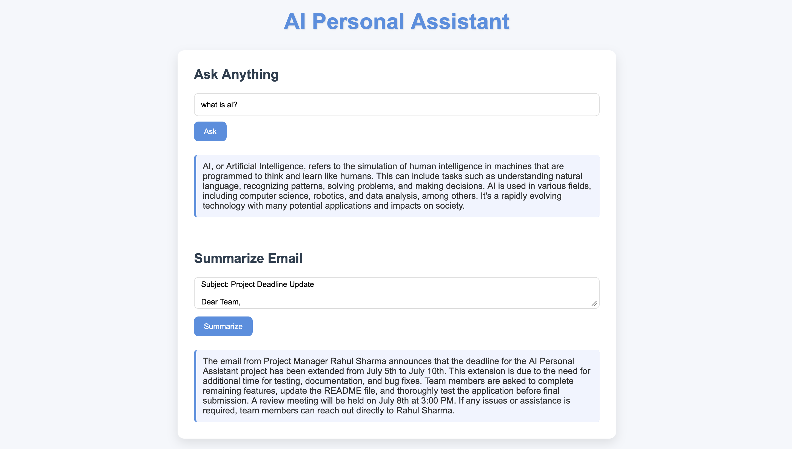

# 🤖 AI Personal Assistant

An AI-powered Personal Assistant built using Flask, Ollama, and Mistral.

## ✨ Features

- 💬 AI Chat Assistant
- 📧 Email Summarization
- 🦙 Ollama Integration
- 🧠 Mistral LLM
- ⚡ Local AI Inference
- 🌐 Flask Web Interface

---

## 🛠️ Tech Stack

- Python
- Flask
- Ollama
- Mistral
- OpenAI SDK
- HTML
- CSS
- JavaScript

---

## 📂 Project Structure

```bash
AI-Personal-Assistant/
│
├── main.py
├── README.md
├── requirements.txt
├── .gitignore
│
├── templates/
│   └── index.html
│
└── static/
    ├── style.css
    └── script.js
```

---

## 🚀 Installation

Clone the repository

```bash
git clone https://github.com/riyakandwal/AI-Personal-Assistant.git

cd AI-Personal-Assistant
```

Install dependencies

```bash
pip install -r requirements.txt
```

Install Ollama

```bash
ollama pull mistral
```

Run the project

```bash
python main.py
```

Open in browser

```text
http://127.0.0.1:5000
```

---

## Demo



---

## 💡 Future Improvements

- 🎤 Voice Assistant
- 🧠 Memory Support
- 📄 PDF Summarization
- 🔍 RAG Integration
- 🤝 Multi-Agent System

---

## 👩‍💻 Author

**Riya Kandwal**

Aspiring AI/ML Engineer passionate about AI and intelligent systems.

GitHub:
https://github.com/riyakandwal
